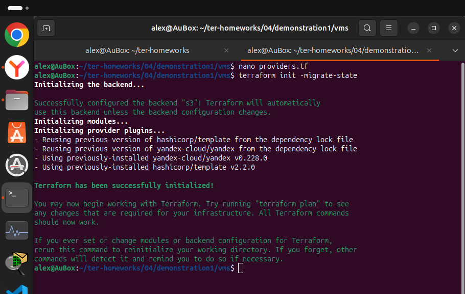
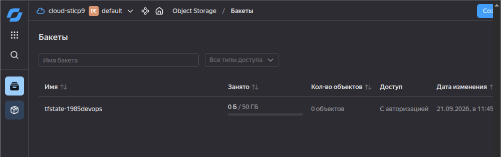
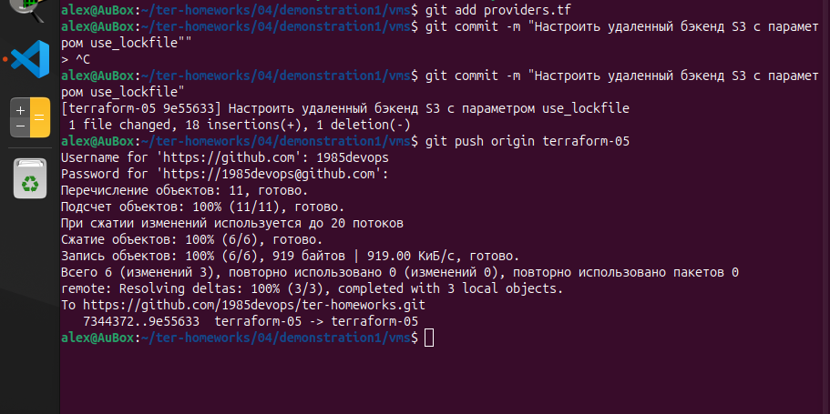
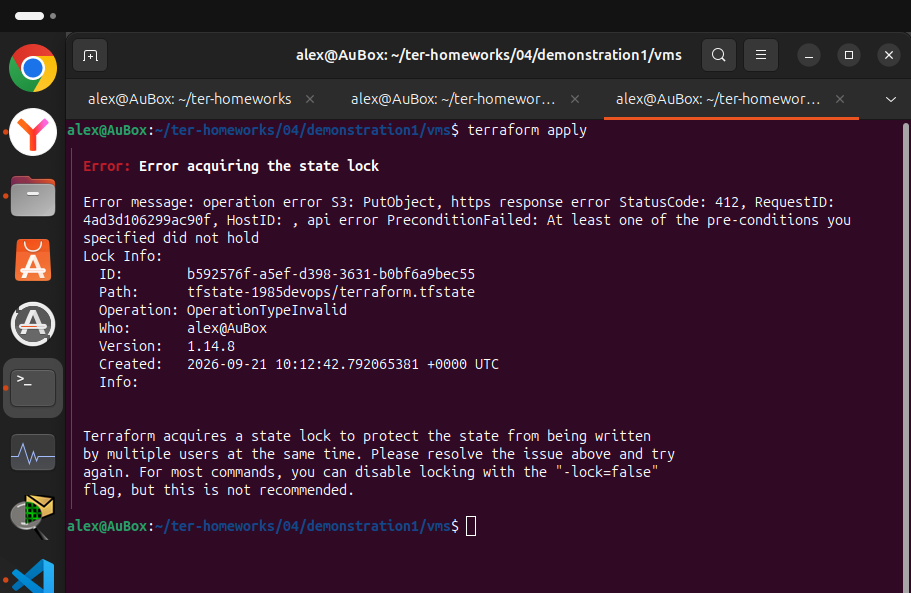
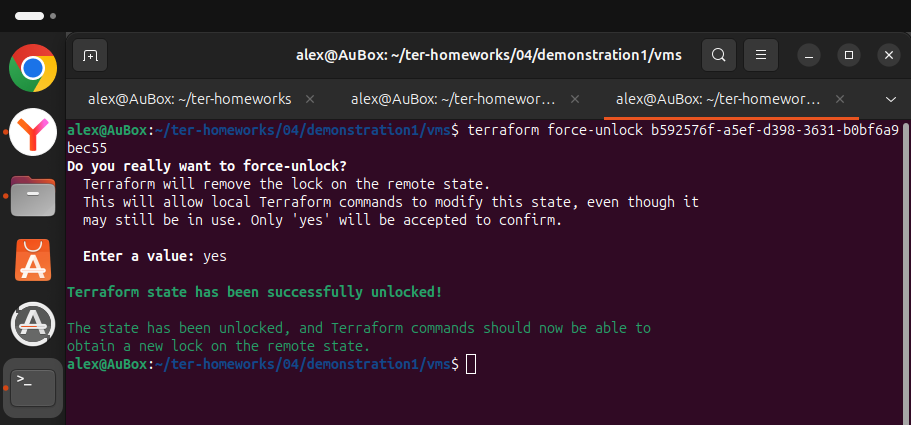
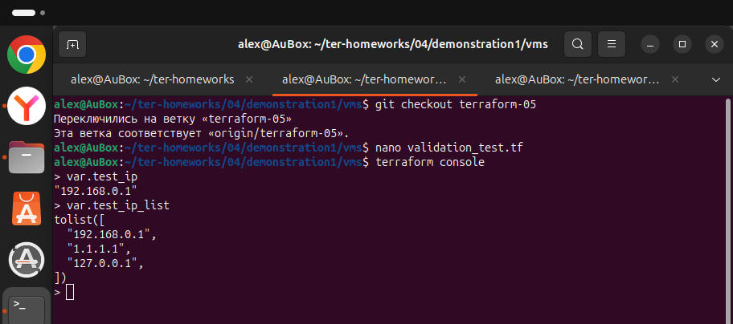
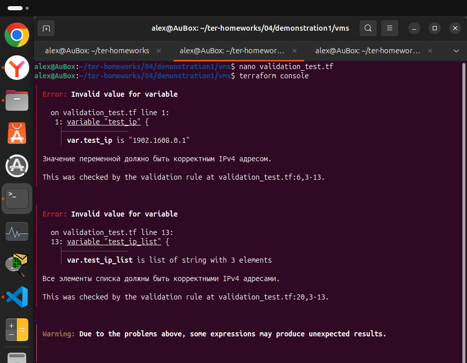

          ###Домашнее задание к занятию «Использование Terraform в команде» - Нугаев Алексей

# Решение 0

* Прочитал, согласен с автором текста.


# Решение 1

* В коде обнаружены ошибки и некоторые моменты которы лучше исправить.
* Устаревший источник данных компонента data "template_file". 
* Подключение модуля через нестабильную ветку ref=main вместо тега версии.
* Параметр public_ip = true, открывающего прямой доступ к ВМ из интернета.
* Включени порт отладки через serial-port-enable = 1.
* Нету межсетевого экрана в создании сетевых ресурсов.
* Секретный ключ в коде


```

$ tflint
Scanning danger/main.tf...

WARN: data "template_file" is deprecated. Use the templatefile() function instead.
  on main.tf line 67:
  67: data "template_file" "cloudinit" {
  Reference: https://github.com

WARN: Module source "git::https://github.com" uses a mutable branch reference (main). Pin to a specific tag or commit SHA for predictability.
  on main.tf line 20:
  20: module "test-vm" {

WARN: Module source "git::https://github.com" uses a mutable branch reference (main). Pin to a specific tag or commit SHA for predictability.
  on main.tf line 44:
  44: module "example-vm" {

Result: 3 warnings found.

```

```

$ checkov -f main.tf

       _               _                  
   ___| |__   ___  ___| |20v  ___  __   __
  / __| '_ \ / _ \/ __| |/ _ \/ _ \ \ \ / /

 | (__| | | |  __/ (__| | (_) | (_) | \ V / 
  \___|_| |_|\___|\___|_|\___/ \___/   \_/  
                                            
By Bridgecrew | version: 3.2.0

Passed checks: 0, Failed checks: 3, Skipped checks: 0

FAILED for resource: module.test-vm
Severity: MEDIUM
Check: CKV_YC_1 "Ensure Compute Instance does not have a public IP address"
File: /main.tf:20-42
  20 | module "test-vm" {
  ...
  29 |   public_ip      = true

FAILED for resource: module.test-vm
Severity: LOW
Check: CKV_YC_2 "Ensure Serial Port is disabled for Compute Instances unless required for troubleshooting"
File: /main.tf:20-42
  20 | module "test-vm" {
  ...
  37 |     serial-port-enable = 1

FAILED for resource: module.example-vm
Severity: MEDIUM
Check: CKV_YC_1 "Ensure Compute Instance does not have a public IP address"
File: /main.tf:44-60
  44 | module "example-vm" {
  ...
  51 |   public_ip      = true

FAILED for resource: module.test-vm & module.example-vm
Severity: HIGH
Check: CKV_YC_3 "Ensure security groups are assigned to network interfaces"
File: /main.tf:20-60
  * Missing security_group_ids parameter or empty list assigned.

FAILED for resource: variable.public_key
Severity: HIGH
Check: CKV_SECRET_1 "Ensure no hardcoded secrets exist in resources or variables"
File: /variables.tf:3-6
  3 | variable "public_key" {
  4 |   type    = string
  5 |   default = "ssh-ed25519 AAAAC3NzaC1lZDI1NTE5AAAAIGiVcfW8Wa/DxbBNzmQcwn7hJOj7ji9eoTpFakVnY/AI webinar"

```

### Решение 2

* Создал бакет tfstate-1985devops в Object Storage Yandex Cloud.
* Настроел удаленный бэкенд S3 с поддержкой блокировок Terraform 1.6+ через параметр use_lockfile = true.
* При попытке параллельного выполнения команд во втором терминале сработала автоматическая блокировка состояния. Ошибка доступа к state LOCK_ID: b592576f-a5ef-d398-3631-b0bf6a9bec55
* Блокировку успешно снял.







### Решение 3

* Ссылка на PR для ревью.  https://github.com/1985devops/ter-homeworks/pull/1

### Решение 4

* Созданы правила для проверки корректности IPv4 адресов, для одиночной строковой переменной и для списка строк.
* При вводе корректных данных 192.168.0.1 утилита `terraform console` успешно инициализируется и отображает переменные.
* При подстановке некорректных тестовых данных 1902.1608.0.1" и списка с ошибкой срабатывают правила валидации и Terraform блокирует выполнение, возвращая заданные error_message.





