     ###Итоговый проект модуля «Облачная инфраструктура. Terraform» - Нугаев Алексей

#Решение 1

* Для базы данных в коде Terraform я создал три объекта:
* Сам кластер yandex_mdb_mysql_cluster. Назвал project-mysql-db. Установил версию MySQL 8.0, с недерогим диском 10 ГБ и привязал к сети в зоне ru-central1-a, чтобы виртуалка могла достучаться до базы.
* база yandex_mdb_mysql_database, внутри этого кластера сделал чистую базу app_database.
* пользователь yandex_mdb_mysql_user, создал юзера db_user, задал ему пароль и дал полные права на базу app_database.
* Реестр yandex_container_registry, создал репозиторий с именем project-registry. Сделал его как облачное хранилище, буду загружать Docker-образы своего приложения с компьютера, а потом скачивать их на созданную виртуалку.

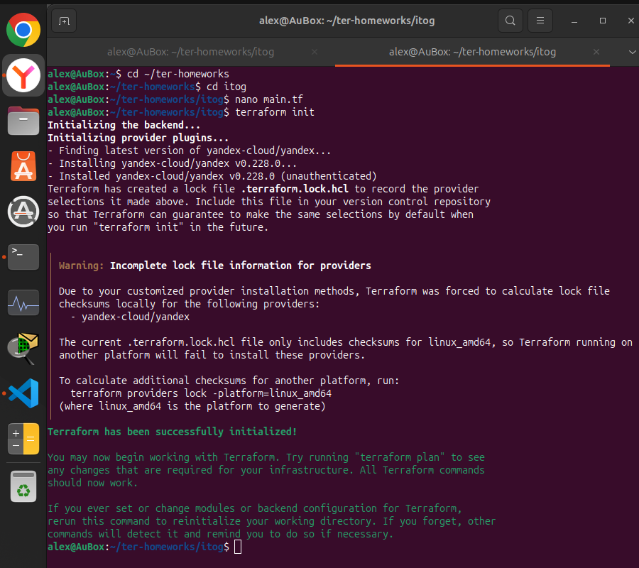
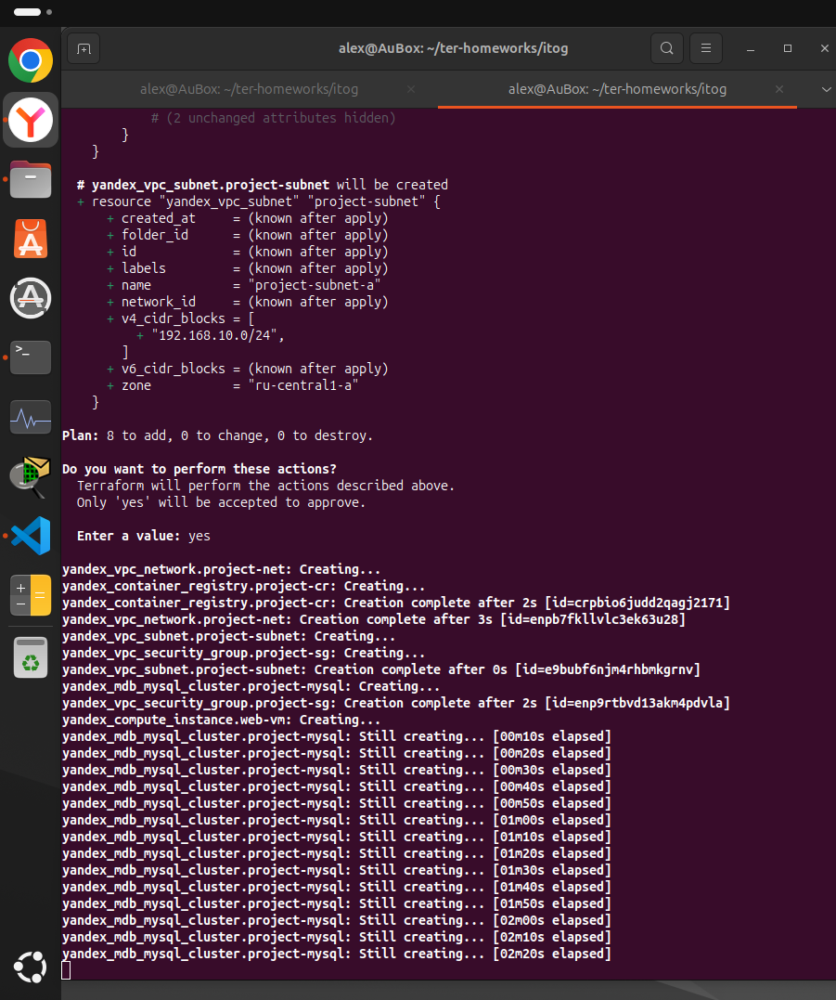
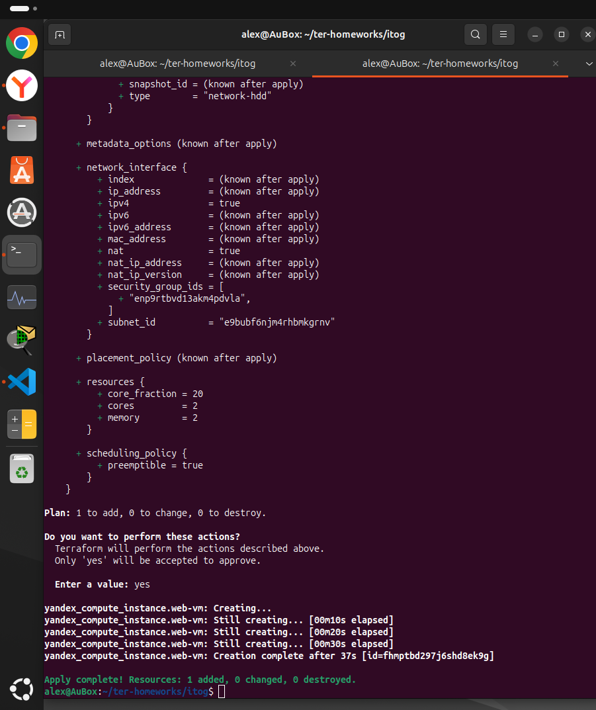
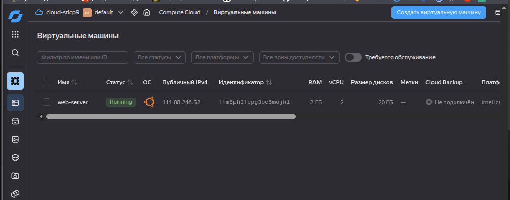
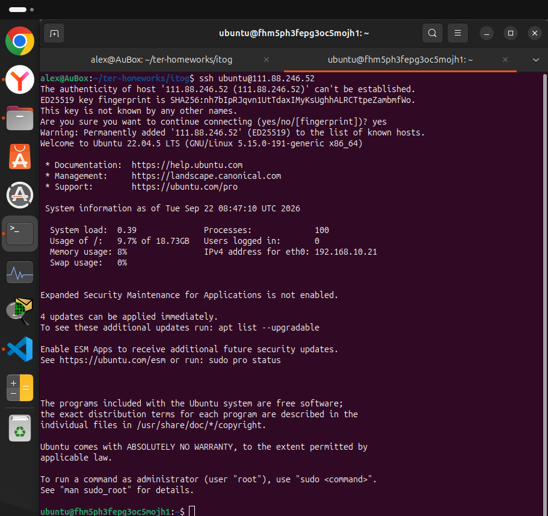

#Решение 2

* Чтобы не ставить Docker и Docker Compose вручную после запуска сервера, настроил автоматическую установку через cloud-init.
* в файле main.tf внутри конфига виртуальной машины, сделал блок metadata и передал туда скрипт user-data.
* В блоке runcmd добавил команду, которая закидывает пользователя ubuntu в группу docker. Это нужно для того, чтобы запускать контейнеры напрямую, без постоянного ввода sudo.
* Прописал автоматический запуск службы Docker сразу при включении виртуальной машины. После применения конфигурации и перезагрузки сервера, проверил работоспособность командами docker --version и docker compose version.

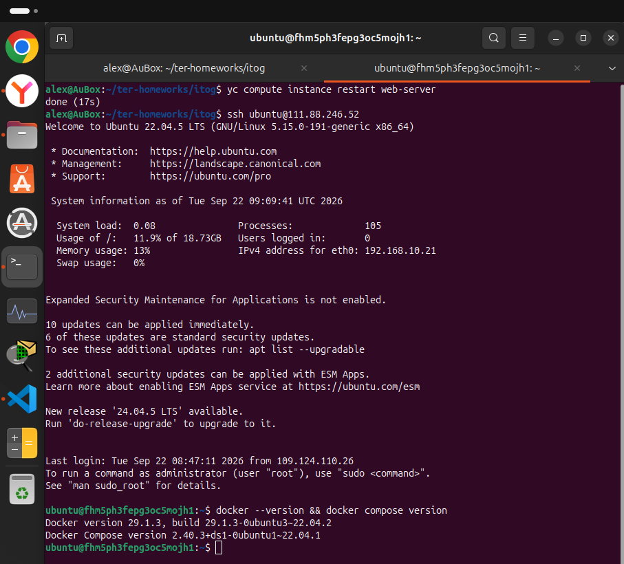

#Решение 3

* Для контейнеризации веб-приложения, сделал на локальной ubuntu.
* Создал Dockerfile, прописал в нём инструкцию для сборки. Взял образ python:3.10-slim, указал рабочую папку /app, обновил установщик пакетов, поставил фреймворк Flask, скопировал код приложения app.py и открыл порт 80 для внешнего трафика.
* Связал локальный Docker с Яндексом, выполнил команду yc container registry configure-docker, чтобы мой компьютер получил права на отправку образов в облачный реестр.
* Скомпилировал образ docker build с тегом v1
* Отправил готовый контейнер в реестр project-registry с помощью команды docker push.

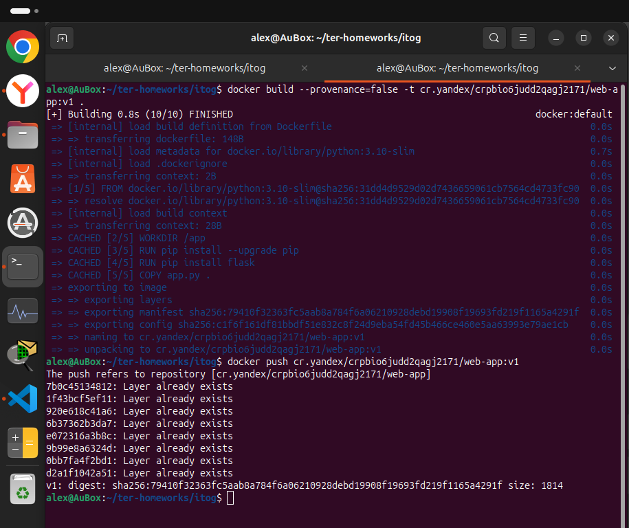

#Решение 4

* Образ приложения собран и запущен на удалённом сервере.
* Параметры доступа к СУБД MySQL передал внутрь контейнера через переменные окружения.
* Настроен внутренний файрвол Ubuntu (UFW) для открытия 80 порта. Приложение успешно обрабатывает HTTP-запросы и держит стабильное соединение с базой данных.

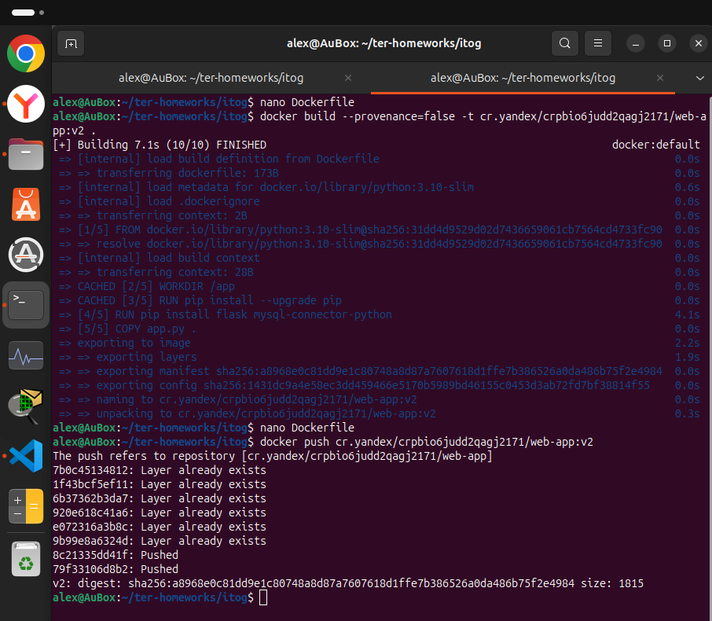
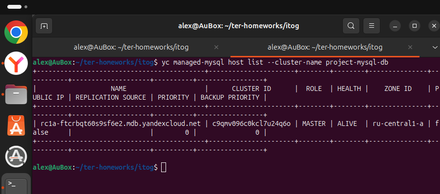
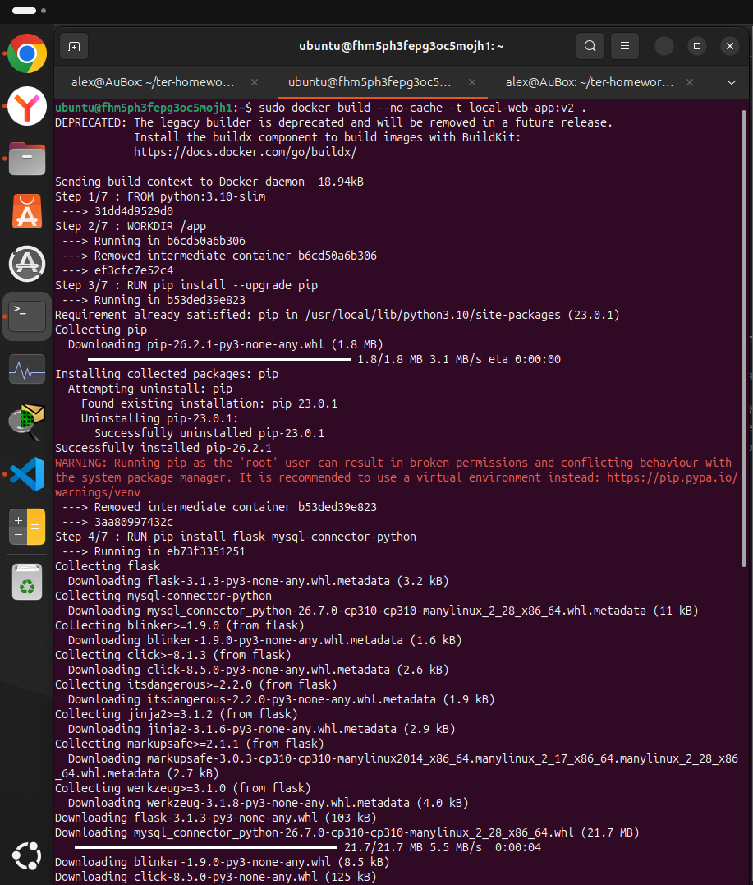
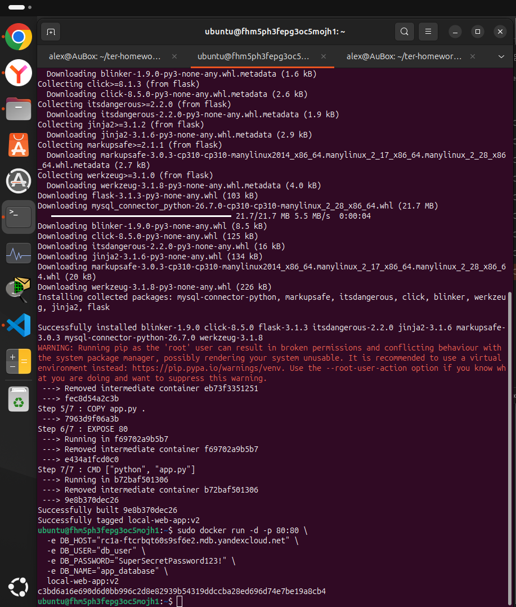
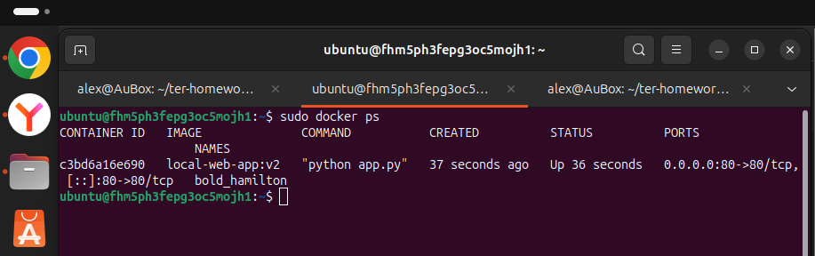
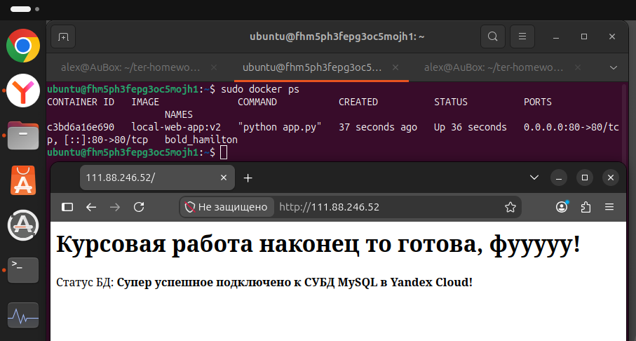

